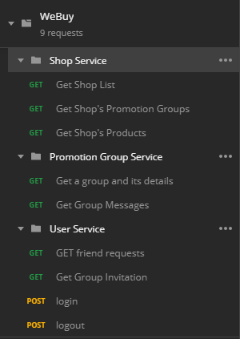

# WebuyAPI
Spring Web Services for Webuy android app

## UML Model Class Diagram

## Service list

## Route list

### Shop Service

Here you can get all the shop in the database.
A parameter could be added to handle pagination.

A parameter could be added to handle pagination.

### Offer Group Service

### User Service

Get all the invitations to a group you've got recently.

Get all the invitations to a group you've got recently.

